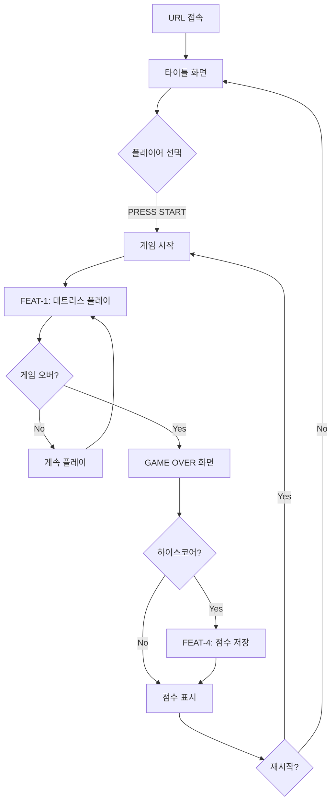
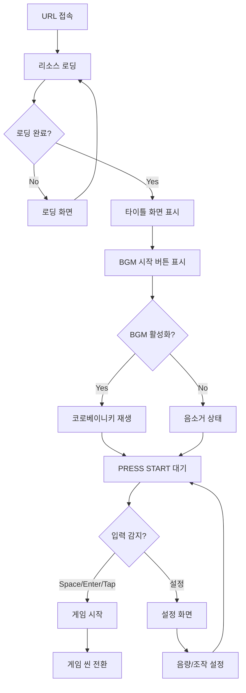
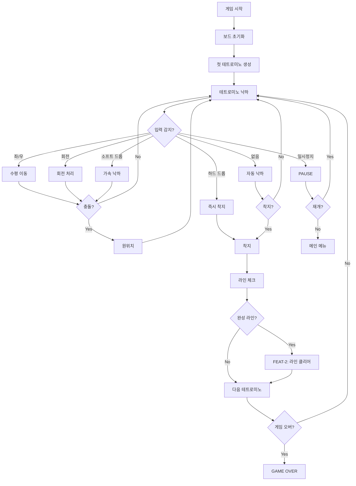
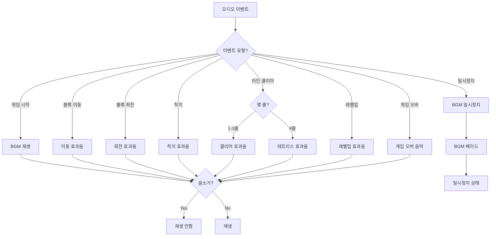
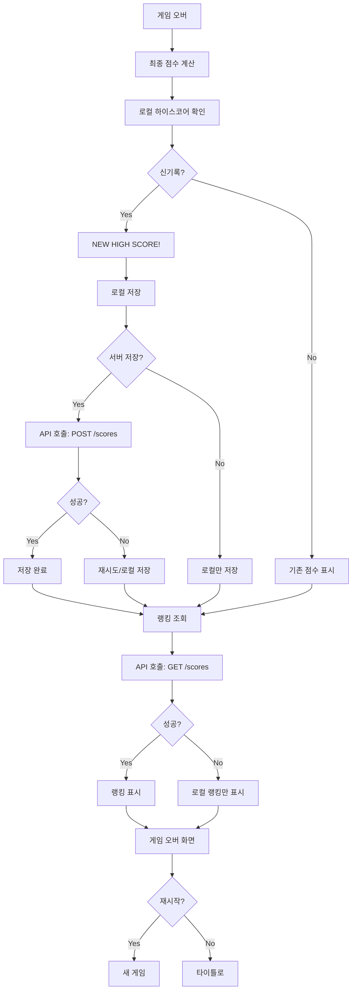
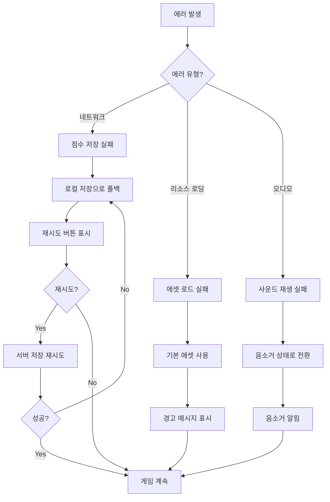
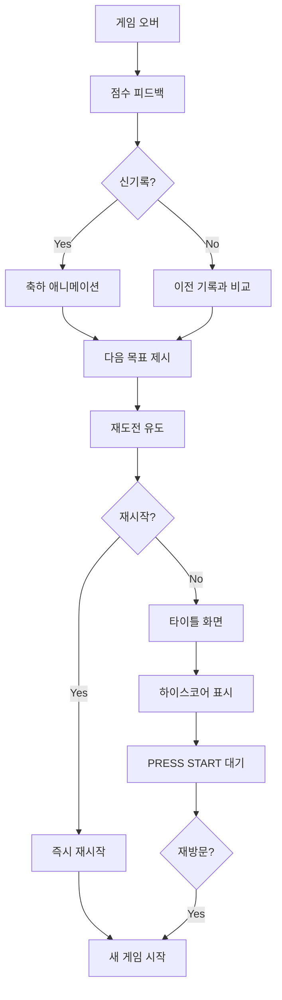

# User Flow (사용자 흐름도)

> Mermaid 플로우차트로 핵심 기능의 주요 여정을 표현합니다.

---

## MVP 캡슐

| # | 항목 | 내용 |
|---|------|------|
| 1 | 목표 | 설치 없이 브라우저에서 바로 즐기는 추억의 고전 테트리스 |
| 2 | 페르소나 | 전 연령 가족 단위 (점심시간/짧은 휴식 시간에 플레이) |
| 3 | 핵심 기능 | FEAT-1: 테트리스 기본 플레이 |
| 4 | 성공 지표 (노스스타) | 평균 세션 지속 시간 10분 이상 |
| 5 | 입력 지표 | 일일 활성 사용자(DAU), 스테이지 10 클리어 비율 |
| 6 | 비기능 요구 | 60fps 유지, 반응형(PC+모바일), 정확한 조작감 |
| 7 | Out-of-scope | 소셜 로그인, 리더보드 공유, 멀티플레이 |
| 8 | Top 리스크 | 조작감이 기대에 미치지 못함 |
| 9 | 완화/실험 | NES 테트리스 프레임 테이블 참조하여 정확한 속도 구현 |
| 10 | 다음 단계 | API 계약 정의 및 테스트 케이스 작성 |

---

## 1. 전체 사용자 여정 (Overview)



---

## 2. FEAT-0: 게임 진입 플로우



---

## 3. FEAT-1: 테트리스 기본 플레이 플로우



---

## 4. FEAT-2: 스테이지/레벨 시스템 플로우

```mermaid
graph TD
    A[라인 클리어] --> B[클리어 라인 수 계산]
    B --> C[점수 계산]

    C --> D{1줄?}
    D -->|Yes| E[40 × (level+1)]

    D -->|No| F{2줄?}
    F -->|Yes| G[100 × (level+1)]

    F -->|No| H{3줄?}
    H -->|Yes| I[300 × (level+1)]

    H -->|No| J[4줄 테트리스!]
    J --> K[1200 × (level+1)]

    E --> L[총 라인 수 업데이트]
    G --> L
    I --> L
    K --> L

    L --> M{레벨업 조건?}
    M -->|10라인마다| N[레벨 증가]
    M -->|No| O[UI 업데이트]

    N --> P{레벨 10 도달?}
    P -->|Yes| Q[최고 레벨 유지]
    P -->|No| R[속도 증가]

    Q --> O
    R --> O

    O --> S[라인 클리어 애니메이션]
    S --> T[FEAT-3: 효과음 재생]
    T --> U[게임 계속]
```

---

## 5. FEAT-3: 오디오 시스템 플로우



---

## 6. FEAT-4: 점수 저장/조회 플로우



---

## 7. 에러 처리 플로우



---

## 8. 리텐션 루프 (습관 형성)



---

## 9. 화면 목록 (Screen Inventory)

| 화면 ID | 화면명 | FEAT | 진입점 | 주요 액션 |
|---------|--------|------|--------|----------|
| S-01 | 로딩 화면 | - | URL 접속 | 리소스 로딩 |
| S-02 | 타이틀 화면 | FEAT-0 | S-01 완료 | START, 설정 |
| S-03 | 설정 화면 | - | S-02 | 음량, 조작 설정 |
| S-04 | 게임 화면 | FEAT-1,2,3 | S-02 START | 테트리스 플레이 |
| S-05 | 일시정지 화면 | - | S-04 PAUSE | 재개, 종료 |
| S-06 | 게임 오버 화면 | FEAT-4 | S-04 게임오버 | 점수, 랭킹, 재시작 |

---

## 10. 화면 레이아웃

### S-04: 게임 화면 레이아웃

```
┌────────────────────────────────────────────────┐
│  SCORE: 012500    LEVEL: 05    LINES: 045     │
├────────────────────────────────────────────────┤
│                                                │
│   ┌──────────┐          ┌──────────┐          │
│   │          │          │  NEXT    │          │
│   │          │          │  ┌────┐  │          │
│   │          │          │  │    │  │          │
│   │  BOARD   │          │  └────┘  │          │
│   │  10×20   │          └──────────┘          │
│   │          │                                │
│   │          │          ┌──────────┐          │
│   │          │          │  HOLD    │          │
│   │          │          │  (v2)    │          │
│   │          │          └──────────┘          │
│   │          │                                │
│   └──────────┘                                │
│                                                │
├────────────────────────────────────────────────┤
│  [PAUSE]                        [RESTART]      │  (모바일)
│  [◀][▼][▶]                     [↻]            │  (터치 컨트롤)
└────────────────────────────────────────────────┘
```

---

## Decision Log 참조

| ID | 항목 | 선택 | 근거 |
|----|------|------|------|
| D-09 | 초기 진입 | 로그인 없이 바로 플레이 | 빠른 접근이 핵심 |
| D-10 | 점수 저장 | 익명 UUID 기반 | 개인정보 최소화 |
| D-11 | 오디오 시작 | 사용자 인터랙션 후 재생 | 브라우저 자동재생 정책 |
