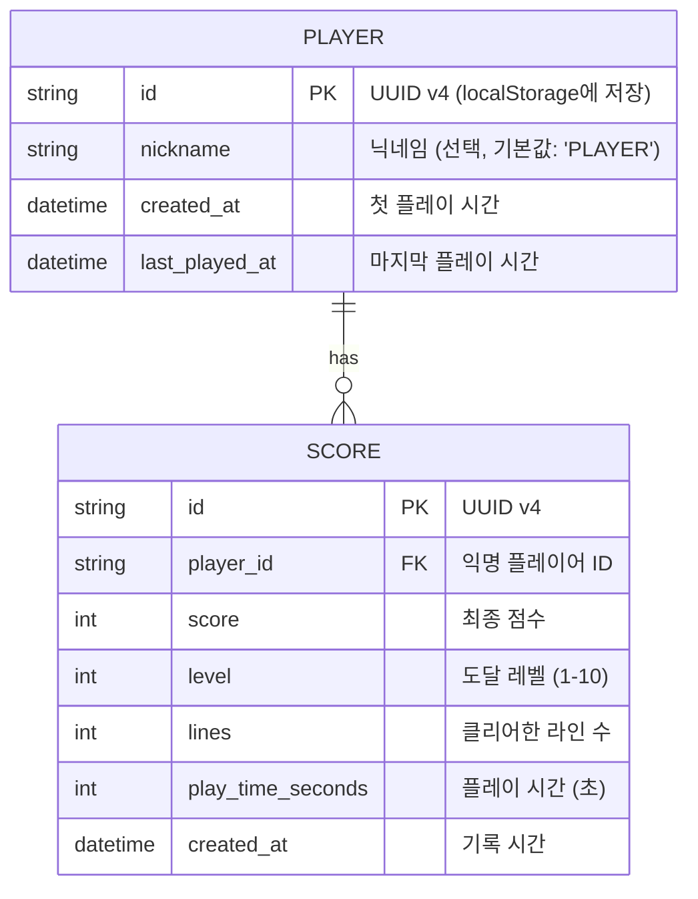
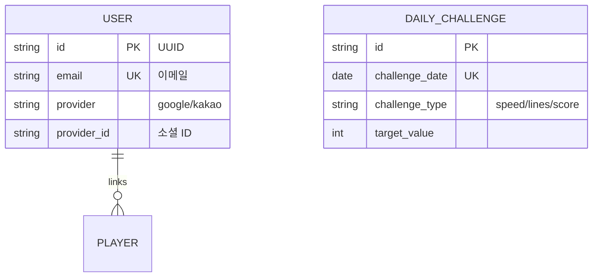

# Database Design (데이터베이스 설계)

> Mermaid ERD로 주요 엔티티와 관계를 표현합니다.
> 최소 수집 원칙을 반영하여 불필요한 개인정보는 지양합니다.

---

## MVP 캡슐

| # | 항목 | 내용 |
|---|------|------|
| 1 | 목표 | 설치 없이 브라우저에서 바로 즐기는 추억의 고전 테트리스 |
| 2 | 페르소나 | 전 연령 가족 단위 (점심시간/짧은 휴식 시간에 플레이) |
| 3 | 핵심 기능 | FEAT-1: 테트리스 기본 플레이 |
| 4 | 성공 지표 (노스스타) | 평균 세션 지속 시간 10분 이상 |
| 5 | 입력 지표 | 일일 활성 사용자(DAU), 스테이지 10 클리어 비율 |
| 6 | 비기능 요구 | 60fps 유지, 반응형(PC+모바일), 정확한 조작감 |
| 7 | Out-of-scope | 소셜 로그인, 리더보드 공유, 멀티플레이 |
| 8 | Top 리스크 | 조작감이 기대에 미치지 못함 |
| 9 | 완화/실험 | NES 테트리스 프레임 테이블 참조하여 정확한 속도 구현 |
| 10 | 다음 단계 | API 계약 정의 및 테스트 케이스 작성 |

---

## 1. ERD (Entity Relationship Diagram)



---

## 2. 엔티티 상세 정의

### 2.1 PLAYER (익명 플레이어) - FEAT-0

| 컬럼 | 타입 | 제약조건 | 설명 |
|------|------|----------|------|
| id | TEXT | PK | UUID v4, 클라이언트에서 생성하여 localStorage에 저장 |
| nickname | TEXT | NOT NULL, DEFAULT 'PLAYER' | 표시 이름 (최대 10자) |
| created_at | TEXT | NOT NULL | ISO 8601 형식 |
| last_played_at | TEXT | NOT NULL | 마지막 플레이 시간 |

**인덱스:**
- PRIMARY KEY on `id`

**최소 수집 원칙 적용:**
- 필수: id (익명 식별용), nickname (순위표 표시)
- 선택: 없음
- 수집 안 함: 이메일, 비밀번호, IP 주소, 기기 정보

**SQLite DDL:**
```sql
CREATE TABLE IF NOT EXISTS player (
    id TEXT PRIMARY KEY,
    nickname TEXT NOT NULL DEFAULT 'PLAYER',
    created_at TEXT NOT NULL DEFAULT (datetime('now')),
    last_played_at TEXT NOT NULL DEFAULT (datetime('now'))
);
```

### 2.2 SCORE (게임 점수) - FEAT-4

| 컬럼 | 타입 | 제약조건 | 설명 |
|------|------|----------|------|
| id | TEXT | PK | UUID v4 |
| player_id | TEXT | FK → PLAYER.id, NOT NULL | 플레이어 참조 |
| score | INTEGER | NOT NULL, CHECK(score >= 0) | 최종 점수 |
| level | INTEGER | NOT NULL, CHECK(level BETWEEN 1 AND 10) | 도달 레벨 |
| lines | INTEGER | NOT NULL, CHECK(lines >= 0) | 클리어 라인 수 |
| play_time_seconds | INTEGER | NOT NULL, CHECK(play_time_seconds >= 0) | 플레이 시간 |
| created_at | TEXT | NOT NULL | 기록 시간 |

**인덱스:**
- PRIMARY KEY on `id`
- `idx_score_player_id` ON player_id
- `idx_score_score_desc` ON score DESC (랭킹 조회용)
- `idx_score_created_at` ON created_at DESC (최신순 조회용)

**SQLite DDL:**
```sql
CREATE TABLE IF NOT EXISTS score (
    id TEXT PRIMARY KEY,
    player_id TEXT NOT NULL,
    score INTEGER NOT NULL CHECK(score >= 0),
    level INTEGER NOT NULL CHECK(level BETWEEN 1 AND 10),
    lines INTEGER NOT NULL CHECK(lines >= 0),
    play_time_seconds INTEGER NOT NULL CHECK(play_time_seconds >= 0),
    created_at TEXT NOT NULL DEFAULT (datetime('now')),
    FOREIGN KEY (player_id) REFERENCES player(id) ON DELETE CASCADE
);

CREATE INDEX IF NOT EXISTS idx_score_player_id ON score(player_id);
CREATE INDEX IF NOT EXISTS idx_score_score_desc ON score(score DESC);
CREATE INDEX IF NOT EXISTS idx_score_created_at ON score(created_at DESC);
```

---

## 3. 관계 정의

| 부모 | 자식 | 관계 | 설명 |
|------|------|------|------|
| PLAYER | SCORE | 1:N | 한 플레이어는 여러 게임 기록을 가짐 |

---

## 4. 데이터 흐름

### 4.1 플레이어 등록 (암묵적)

```
1. 클라이언트: localStorage에 player_id 확인
2. 없으면: UUID 생성 → localStorage 저장 → 서버에 등록 (선택)
3. 있으면: 기존 ID 사용
```

### 4.2 점수 저장

```
게임 오버
    ↓
점수 계산 (score, level, lines, play_time)
    ↓
API 호출: POST /api/v1/scores
    ↓
서버: 유효성 검증
    ↓
DB 저장
    ↓
클라이언트: 로컬 캐시 업데이트
```

### 4.3 랭킹 조회

```
API 호출: GET /api/v1/scores?limit=10
    ↓
서버: score DESC 정렬하여 반환
    ↓
클라이언트: 랭킹 표시
```

---

## 5. 데이터 생명주기

| 엔티티 | 생성 시점 | 보존 기간 | 삭제/익명화 |
|--------|----------|----------|------------|
| PLAYER | 첫 플레이 | 무기한 | 이미 익명 |
| SCORE | 게임 완료 | 무기한 | 필요 시 오래된 기록 정리 |

---

## 6. API 스키마 (Pydantic)

### 6.1 요청 스키마

```python
# backend/app/schemas/score.py

from pydantic import BaseModel, Field
from datetime import datetime
from uuid import UUID

class ScoreCreate(BaseModel):
    """점수 저장 요청"""
    player_id: str = Field(..., description="플레이어 UUID")
    score: int = Field(..., ge=0, description="최종 점수")
    level: int = Field(..., ge=1, le=10, description="도달 레벨")
    lines: int = Field(..., ge=0, description="클리어 라인 수")
    play_time_seconds: int = Field(..., ge=0, description="플레이 시간(초)")

class PlayerCreate(BaseModel):
    """플레이어 등록 요청"""
    id: str = Field(..., description="클라이언트 생성 UUID")
    nickname: str = Field(default="PLAYER", max_length=10, description="닉네임")
```

### 6.2 응답 스키마

```python
class ScoreResponse(BaseModel):
    """점수 응답"""
    id: str
    player_id: str
    score: int
    level: int
    lines: int
    play_time_seconds: int
    created_at: datetime

    class Config:
        from_attributes = True

class ScoreRanking(BaseModel):
    """랭킹 항목"""
    rank: int
    player_nickname: str
    score: int
    level: int
    lines: int
    created_at: datetime

class ScoreListResponse(BaseModel):
    """랭킹 목록 응답"""
    data: list[ScoreRanking]
    total: int
```

---

## 7. 쿼리 예시

### 7.1 점수 저장

```sql
INSERT INTO score (id, player_id, score, level, lines, play_time_seconds, created_at)
VALUES (?, ?, ?, ?, ?, ?, datetime('now'));
```

### 7.2 Top 10 랭킹 조회

```sql
SELECT
    ROW_NUMBER() OVER (ORDER BY s.score DESC) as rank,
    p.nickname as player_nickname,
    s.score,
    s.level,
    s.lines,
    s.created_at
FROM score s
JOIN player p ON s.player_id = p.id
ORDER BY s.score DESC
LIMIT 10;
```

### 7.3 특정 플레이어의 최고 점수

```sql
SELECT MAX(score) as best_score
FROM score
WHERE player_id = ?;
```

### 7.4 플레이어 개인 기록 목록

```sql
SELECT *
FROM score
WHERE player_id = ?
ORDER BY created_at DESC
LIMIT 10;
```

---

## 8. 확장 고려사항

### 8.1 v2에서 추가 예정 엔티티



### 8.2 인덱스 전략

MVP:
- 랭킹 조회 최적화: `score DESC` 인덱스
- 개인 기록 조회: `player_id` + `created_at DESC` 복합 인덱스

v2 고려:
- 일별 랭킹: `created_at` 파티셔닝 또는 별도 집계 테이블

---

## 9. 데이터 검증 규칙

### 9.1 클라이언트 측

| 필드 | 검증 |
|------|------|
| player_id | UUID 형식 |
| score | 0 이상, 합리적 상한 (예: 1,000,000) |
| level | 1-10 |
| lines | 0 이상 |
| play_time | 0 이상, 합리적 상한 (예: 3600초 = 1시간) |

### 9.2 서버 측 (추가 검증)

| 항목 | 검증 |
|------|------|
| 점수-레벨 일관성 | 레벨 10에서 최소 점수 체크 |
| 플레이 시간-점수 | 비정상적으로 짧은 시간에 높은 점수 거부 |
| 중복 제출 방지 | 동일 player_id로 1초 내 중복 요청 거부 |

---

## Decision Log 참조

| ID | 항목 | 선택 | 근거 |
|----|------|------|------|
| D-12 | 플레이어 식별 | 익명 UUID | 개인정보 최소화, 가입 없이 플레이 |
| D-13 | DB | SQLite | 서버리스 친화, MVP에 충분한 성능 |
| D-14 | 점수 검증 | 서버 측 최소 검증 | 부정 행위 최소 방지, MVP 복잡도 관리 |
