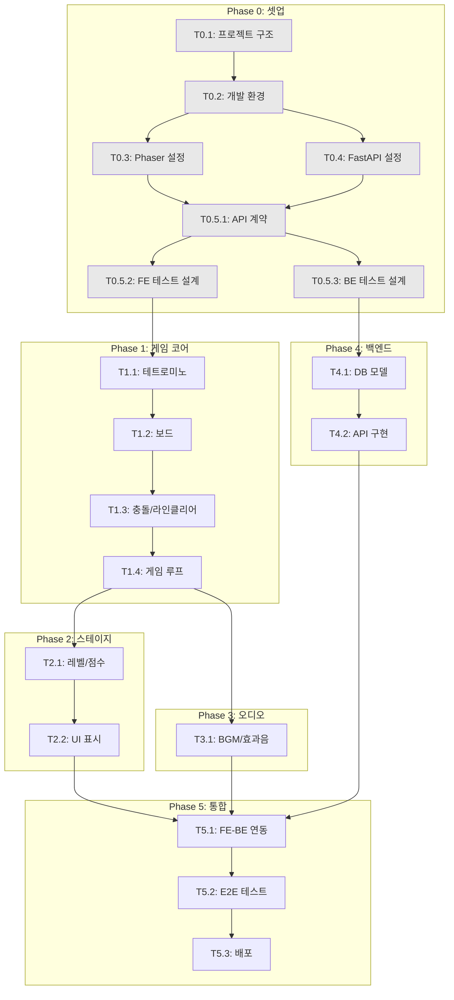

# TASKS: 클래식 테트리스

> AI 개발 파트너용 태스크 목록 (Contract-First TDD 기반)

---

## MVP 캡슐

| # | 항목 | 내용 |
|---|------|------|
| 1 | 목표 | 설치 없이 브라우저에서 바로 즐기는 추억의 고전 테트리스 |
| 2 | 페르소나 | 전 연령 가족 단위 (점심시간/짧은 휴식 시간에 플레이) |
| 3 | 핵심 기능 | FEAT-1: 테트리스 기본 플레이 |
| 4 | 성공 지표 (노스스타) | 평균 세션 지속 시간 10분 이상 |
| 5 | 입력 지표 | 일일 활성 사용자(DAU), 스테이지 10 클리어 비율 |
| 6 | 비기능 요구 | 60fps 유지, 반응형(PC+모바일), 정확한 조작감 |
| 7 | Out-of-scope | 소셜 로그인, 리더보드 공유, 멀티플레이 |
| 8 | Top 리스크 | 조작감이 기대에 미치지 못함 |
| 9 | 완화/실험 | NES 테트리스 프레임 테이블 참조하여 정확한 속도 구현 |
| 10 | 다음 단계 | API 계약 정의 및 테스트 케이스 작성 |

---

## 기술 스택

| 영역 | 기술 |
|------|------|
| 프론트엔드 | Phaser 3 + TypeScript + Vite |
| 백엔드 | FastAPI + Python 3.11+ |
| 데이터베이스 | SQLite |
| 테스트 | Vitest (FE) + pytest (BE) + Playwright (E2E) |

---

## 마일스톤 개요

| 마일스톤 | 설명 | Phase | 담당 |
|----------|------|-------|------|
| M0 | 프로젝트 셋업 | Phase 0 | frontend-specialist |
| M0.5 | 계약 & 테스트 설계 | Phase 0 | test-specialist |
| M1 | FEAT-1: 게임 코어 로직 | Phase 1 | frontend-specialist |
| M2 | FEAT-2: 스테이지 시스템 | Phase 2 | frontend-specialist |
| M3 | FEAT-3: 오디오 시스템 | Phase 3 | frontend-specialist |
| M4 | FEAT-4: 점수 API | Phase 4 | backend-specialist |
| M5 | 통합 및 배포 | Phase 5 | frontend-specialist |

---

## 병렬 실행 가능 태스크

| 그룹 | 태스크 | 병렬 가능 |
|------|--------|----------|
| A | T1.1 (테트로미노) + T4.1 (DB 모델) | Yes |
| B | T1.2 (보드) + T4.2 (API 엔드포인트) | Yes |
| C | T2.1 (레벨 시스템) + T3.1 (오디오) | Yes |

---

## 의존성 그래프



---

## M0: 프로젝트 셋업

### [x] Phase 0, T0.1: 프로젝트 구조 초기화

**담당**: frontend-specialist

**작업 내용**:
- 모노레포 구조 생성 (frontend/, backend/, contracts/, docs/)
- Git 초기화 및 .gitignore 설정
- README.md 작성

**산출물**:
- `frontend/` - Vite + TypeScript 프로젝트
- `backend/` - FastAPI 프로젝트
- `contracts/` - API 계약 (공유 타입)
- `.gitignore`
- `README.md`

**완료 조건**:
- [ ] 디렉토리 구조 생성 완료
- [ ] Git 저장소 초기화 완료

---

### [x] Phase 0, T0.2: 개발 환경 설정

**담당**: frontend-specialist

**작업 내용**:
- Node.js 패키지 설치 (Vite, Phaser, TypeScript, Vitest)
- Python 가상환경 및 의존성 설치 (FastAPI, SQLAlchemy, pytest)
- Docker Compose 설정 (선택)
- ESLint, Prettier, Ruff 설정

**산출물**:
- `frontend/package.json`
- `backend/requirements.txt`
- `docker-compose.yml` (선택)
- `.eslintrc.js`, `.prettierrc`
- `backend/pyproject.toml` (Ruff 설정)

**완료 조건**:
- [ ] `npm install` 성공
- [ ] `pip install -r requirements.txt` 성공
- [ ] `npm run lint` 성공
- [ ] `ruff check .` 성공

---

### [x] Phase 0, T0.3: Phaser 3 프로젝트 초기화

**담당**: frontend-specialist

**작업 내용**:
- Phaser 3 설정 파일 작성 (game.config.ts)
- 기본 씬 구조 생성 (BootScene, TitleScene, GameScene, GameOverScene)
- 에셋 로더 설정
- 타입 정의 파일 생성

**산출물**:
- `frontend/src/game/config/game.config.ts`
- `frontend/src/game/scenes/BootScene.ts`
- `frontend/src/game/scenes/TitleScene.ts`
- `frontend/src/game/scenes/GameScene.ts`
- `frontend/src/game/scenes/GameOverScene.ts`
- `frontend/src/types/game.types.ts`

**완료 조건**:
- [ ] `npm run dev` 실행 시 빈 Phaser 화면 표시
- [ ] 씬 전환 동작 확인 (Boot → Title)

---

### [x] Phase 0, T0.4: FastAPI 프로젝트 초기화

**담당**: backend-specialist

**작업 내용**:
- FastAPI 앱 구조 생성
- SQLite 데이터베이스 연결 설정
- CORS 설정
- 헬스체크 엔드포인트

**산출물**:
- `backend/app/main.py`
- `backend/app/database.py`
- `backend/app/models/__init__.py`
- `backend/app/routes/__init__.py`
- `backend/app/schemas/__init__.py`

**완료 조건**:
- [ ] `uvicorn app.main:app --reload` 실행 성공
- [ ] `GET /health` 응답 확인
- [ ] `/docs` Swagger UI 접근 가능

---

## M0.5: 계약 & 테스트 설계

### [x] Phase 0, T0.5.1: API 계약 정의

**담당**: test-specialist

**작업 내용**:
- 점수 API 계약 정의 (TypeScript)
- Pydantic 스키마와 동기화
- MSW 핸들러 템플릿 작성

**산출물**:
- `contracts/types.ts` - 공통 타입
- `contracts/score.contract.ts` - 점수 API 계약
- `backend/app/schemas/score.py` - Pydantic 스키마
- `frontend/src/mocks/handlers/score.ts` - MSW 핸들러

**완료 조건**:
- [ ] TypeScript 타입과 Pydantic 스키마 일치
- [ ] API 계약 문서 작성 완료

---

### [x] Phase 0, T0.5.2: 프론트엔드 테스트 설계 (RED)

**담당**: test-specialist

**작업 내용**:
- 게임 로직 테스트 케이스 작성 (Vitest)
- 테트로미노, 보드, 충돌 감지 테스트
- 모든 테스트가 FAIL 상태 확인

**산출물**:
- `frontend/tests/unit/tetromino.test.ts`
- `frontend/tests/unit/board.test.ts`
- `frontend/tests/unit/collision.test.ts`
- `frontend/tests/unit/scoring.test.ts`

**완료 조건**:
- [ ] 모든 테스트 파일 생성
- [ ] `npm run test` 실행 시 모두 FAIL (RED 상태)
- [ ] 테스트 케이스 30개 이상

---

### [x] Phase 0, T0.5.3: 백엔드 테스트 설계 (GREEN - API 이미 구현됨)

**담당**: test-specialist

**작업 내용**:
- API 테스트 케이스 작성 (pytest)
- 점수 저장/조회 테스트
- 모든 테스트가 FAIL 상태 확인

**산출물**:
- `backend/tests/api/test_score.py`
- `backend/tests/conftest.py` (테스트 픽스처)

**완료 조건**:
- [ ] 모든 테스트 파일 생성
- [ ] `pytest` 실행 시 모두 FAIL (RED 상태)
- [ ] 테스트 케이스 10개 이상

---

## M1: FEAT-1 게임 코어 로직

### [ ] Phase 1, T1.1: 테트로미노 클래스 구현 RED→GREEN

**담당**: frontend-specialist

**Git Worktree 설정**:
```bash
# 1. Worktree 생성
git worktree add ../tetris-phase1-tetromino -b phase/1-tetromino
cd ../tetris-phase1-tetromino

# 2. 작업 완료 후 정리 (자동 실행)
```

**TDD 사이클**:

1. **RED**: 테스트 확인 (실패)
   ```bash
   # 테스트 파일: frontend/tests/unit/tetromino.test.ts
   npm run test -- tests/unit/tetromino.test.ts
   # Expected: FAILED
   ```

2. **GREEN**: 최소 구현 (테스트 통과)
   ```bash
   # 구현 파일: frontend/src/game/objects/Tetromino.ts
   npm run test -- tests/unit/tetromino.test.ts
   # Expected: PASSED
   ```

3. **REFACTOR**: 리팩토링

**구현 내용**:
- 7가지 테트로미노 타입 (I, O, T, S, Z, J, L)
- 회전 로직 (시계방향/반시계방향)
- 모양 데이터 (4x4 매트릭스)
- NES 회전 시스템 적용

**산출물**:
- `frontend/src/game/objects/Tetromino.ts`
- `frontend/src/game/config/tetrominos.ts` (모양 데이터)

**인수 조건**:
- [ ] 테스트 먼저 작성됨 (RED 확인)
- [ ] 모든 테스트 통과 (GREEN)
- [ ] 커버리지 >= 80%

**완료 시 자동 실행**:
```bash
git add -A && git commit -m "$(cat <<'EOF'
기능: 테트로미노 클래스 구현

- 7가지 테트로미노 타입 정의
- 회전 로직 구현 (NES 스타일)
- 모양 데이터 매트릭스 정의
- 단위 테스트 통과

태스크: Phase 1, T1.1
EOF
)"
git checkout main && git merge phase/1-tetromino --no-ff -m "병합: Phase 1 - 테트로미노"
git worktree remove ../tetris-phase1-tetromino && git branch -d phase/1-tetromino
```

---

### [ ] Phase 1, T1.2: 게임 보드 구현 RED→GREEN

**담당**: frontend-specialist

**Git Worktree 설정**:
```bash
git worktree add ../tetris-phase1-board -b phase/1-board
cd ../tetris-phase1-board
```

**TDD 사이클**:

1. **RED**: 테스트 확인
   ```bash
   npm run test -- tests/unit/board.test.ts
   ```

2. **GREEN**: 구현
   ```bash
   # 구현 파일: frontend/src/game/objects/Board.ts
   ```

3. **REFACTOR**: 리팩토링

**구현 내용**:
- 10x20 그리드 관리
- 셀 상태 관리 (빈칸/채워진 블록)
- 테트로미노 배치

**산출물**:
- `frontend/src/game/objects/Board.ts`

**인수 조건**:
- [ ] 10x20 그리드 정상 동작
- [ ] 모든 테스트 통과

**완료 시 자동 실행**: (T1.1과 동일 패턴)

---

### [ ] Phase 1, T1.3: 충돌 감지 & 라인 클리어 RED→GREEN

**담당**: frontend-specialist

**Git Worktree 설정**:
```bash
git worktree add ../tetris-phase1-collision -b phase/1-collision
cd ../tetris-phase1-collision
```

**TDD 사이클**:

1. **RED**: 테스트 확인
   ```bash
   npm run test -- tests/unit/collision.test.ts
   ```

2. **GREEN**: 구현
   ```bash
   # 구현 파일: frontend/src/game/systems/CollisionSystem.ts
   ```

**구현 내용**:
- 벽 충돌 감지
- 바닥 충돌 감지
- 다른 블록과 충돌 감지
- 완성된 라인 감지
- 라인 클리어 (삭제 + 위 블록 낙하)

**산출물**:
- `frontend/src/game/systems/CollisionSystem.ts`

**인수 조건**:
- [ ] 모든 충돌 케이스 테스트 통과
- [ ] 라인 클리어 정상 동작

---

### [ ] Phase 1, T1.4: 게임 루프 & 입력 처리 RED→GREEN

**담당**: frontend-specialist

**Git Worktree 설정**:
```bash
git worktree add ../tetris-phase1-gameloop -b phase/1-gameloop
cd ../tetris-phase1-gameloop
```

**구현 내용**:
- 메인 게임 루프 (update)
- 낙하 타이머 관리
- 키보드 입력 처리 (이동, 회전, 드롭)
- 일시정지 기능
- 게임 오버 감지

**산출물**:
- `frontend/src/game/scenes/GameScene.ts` (확장)
- `frontend/src/game/systems/InputManager.ts`

**인수 조건**:
- [ ] 60fps 유지
- [ ] 키보드 조작 정상 동작
- [ ] 게임 오버 정상 감지

---

## M2: FEAT-2 스테이지 시스템

### [ ] Phase 2, T2.1: 레벨/점수 시스템 RED→GREEN

**담당**: frontend-specialist

**Git Worktree 설정**:
```bash
git worktree add ../tetris-phase2-scoring -b phase/2-scoring
cd ../tetris-phase2-scoring
```

**TDD 사이클**:

1. **RED**: 테스트 확인
   ```bash
   npm run test -- tests/unit/scoring.test.ts
   ```

2. **GREEN**: 구현

**구현 내용**:
- NES 점수 계산 (1줄=40, 2줄=100, 3줄=300, 4줄=1200) × (level+1)
- 레벨업 조건 (10라인마다)
- 레벨별 낙하 속도 (NES 프레임 테이블)

**산출물**:
- `frontend/src/game/objects/ScoreManager.ts`
- `frontend/src/game/config/levels.ts`

**인수 조건**:
- [ ] 점수 계산 정확
- [ ] 레벨 1~10 속도 차이 구현
- [ ] 모든 테스트 통과

---

### [ ] Phase 2, T2.2: 게임 UI 표시 RED→GREEN

**담당**: frontend-specialist

**Git Worktree 설정**:
```bash
git worktree add ../tetris-phase2-ui -b phase/2-ui
cd ../tetris-phase2-ui
```

**구현 내용**:
- 점수 표시 (SCORE)
- 레벨 표시 (LEVEL)
- 라인 표시 (LINES)
- 다음 블록 미리보기 (NEXT)
- 타이틀 화면
- 게임 오버 화면
- 반응형 레이아웃 (모바일 터치 컨트롤)

**산출물**:
- `frontend/src/game/scenes/TitleScene.ts` (확장)
- `frontend/src/game/scenes/GameOverScene.ts` (확장)
- `frontend/src/game/ui/GameUI.ts`
- `frontend/src/game/ui/TouchControls.ts`

**인수 조건**:
- [ ] UI 요소 정상 표시
- [ ] 모바일 터치 동작

---

## M3: FEAT-3 오디오 시스템

### [ ] Phase 3, T3.1: BGM & 효과음 구현

**담당**: frontend-specialist

**Git Worktree 설정**:
```bash
git worktree add ../tetris-phase3-audio -b phase/3-audio
cd ../tetris-phase3-audio
```

**구현 내용**:
- 오디오 매니저 클래스
- BGM 재생 (코로베이니키 - Public Domain 버전)
- 효과음 재생 (이동, 회전, 착지, 클리어, 레벨업, 게임오버)
- 음소거 토글
- 볼륨 조절

**산출물**:
- `frontend/src/game/systems/AudioManager.ts`
- `frontend/public/assets/audio/bgm-korobeiniki.mp3`
- `frontend/public/assets/audio/sfx-*.wav`

**인수 조건**:
- [ ] BGM 정상 재생
- [ ] 효과음 타이밍 정확
- [ ] 음소거 동작

---

## M4: FEAT-4 점수 API

### [ ] Phase 4, T4.1: 데이터베이스 모델 구현 RED→GREEN

**담당**: backend-specialist

**Git Worktree 설정**:
```bash
git worktree add ../tetris-phase4-db -b phase/4-db
cd ../tetris-phase4-db
```

**TDD 사이클**:

1. **RED**: 테스트 확인
   ```bash
   pytest tests/api/test_score.py -v
   ```

2. **GREEN**: 구현

**구현 내용**:
- Player 모델 (SQLAlchemy)
- Score 모델 (SQLAlchemy)
- 데이터베이스 마이그레이션

**산출물**:
- `backend/app/models/player.py`
- `backend/app/models/score.py`

**인수 조건**:
- [ ] 모델 생성 성공
- [ ] 테이블 생성 확인

---

### [ ] Phase 4, T4.2: 점수 API 구현 RED→GREEN

**담당**: backend-specialist

**Git Worktree 설정**:
```bash
git worktree add ../tetris-phase4-api -b phase/4-api
cd ../tetris-phase4-api
```

**구현 내용**:
- `POST /api/v1/scores` - 점수 저장
- `GET /api/v1/scores` - 랭킹 조회
- `GET /api/v1/scores/{player_id}` - 개인 기록 조회
- 입력 검증 (Pydantic)
- 서비스 레이어 분리

**산출물**:
- `backend/app/routes/score.py`
- `backend/app/services/score.py`
- `backend/app/schemas/score.py` (확장)

**인수 조건**:
- [ ] 모든 API 테스트 통과
- [ ] Swagger 문서 정상 표시
- [ ] 에러 응답 형식 준수

---

## M5: 통합 및 배포

### [ ] Phase 5, T5.1: 프론트엔드-백엔드 연동

**담당**: frontend-specialist

**Git Worktree 설정**:
```bash
git worktree add ../tetris-phase5-integration -b phase/5-integration
cd ../tetris-phase5-integration
```

**구현 내용**:
- API 클라이언트 구현 (fetch)
- 게임 오버 시 점수 저장
- 랭킹 조회 및 표시
- MSW → 실제 API 전환
- 에러 핸들링 (네트워크 실패 시 로컬 저장)

**산출물**:
- `frontend/src/services/scoreApi.ts`
- `frontend/src/game/scenes/GameOverScene.ts` (확장)

**인수 조건**:
- [ ] 점수 저장 성공
- [ ] 랭킹 표시 성공
- [ ] 오프라인 폴백 동작

---

### [ ] Phase 5, T5.2: E2E 테스트

**담당**: test-specialist

**Git Worktree 설정**:
```bash
git worktree add ../tetris-phase5-e2e -b phase/5-e2e
cd ../tetris-phase5-e2e
```

**구현 내용**:
- Playwright E2E 테스트 작성
- 게임 시작 → 플레이 → 게임 오버 → 점수 저장 플로우
- 반응형 테스트 (데스크톱/모바일)

**산출물**:
- `frontend/e2e/game.spec.ts`
- `frontend/playwright.config.ts`

**인수 조건**:
- [ ] E2E 테스트 통과
- [ ] 주요 사용자 플로우 커버

---

### [ ] Phase 5, T5.3: 배포 설정

**담당**: frontend-specialist

**구현 내용**:
- 프론트엔드 빌드 최적화
- Vercel/Netlify 배포 설정
- 백엔드 Railway/Render 배포 설정
- 환경 변수 설정
- CORS 프로덕션 설정

**산출물**:
- `frontend/vercel.json` 또는 `netlify.toml`
- `backend/Procfile` (Railway용)
- `.env.example`

**인수 조건**:
- [ ] 프론트엔드 배포 성공
- [ ] 백엔드 배포 성공
- [ ] 프로덕션 환경 정상 동작

---

## 품질 검증 명령어

```bash
# 프론트엔드
cd frontend
npm run lint          # ESLint
npm run type-check    # TypeScript
npm run test          # Vitest
npm run test:coverage # 커버리지

# 백엔드
cd backend
ruff check .          # Ruff 린터
mypy app/             # 타입 체크 (선택)
pytest                # pytest
pytest --cov=app      # 커버리지

# E2E
npx playwright test
```

---

## 다음 우선순위 작업

1. **T0.1**: 프로젝트 구조 초기화
2. **T0.2**: 개발 환경 설정
3. **T0.3 + T0.4**: Phaser/FastAPI 초기화 (병렬 가능)
4. **T0.5.1 ~ T0.5.3**: 계약 및 테스트 설계 (RED)
